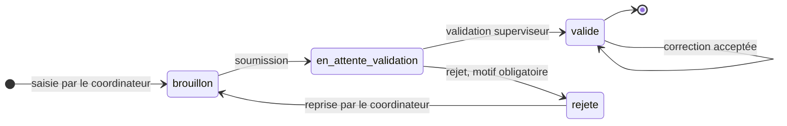
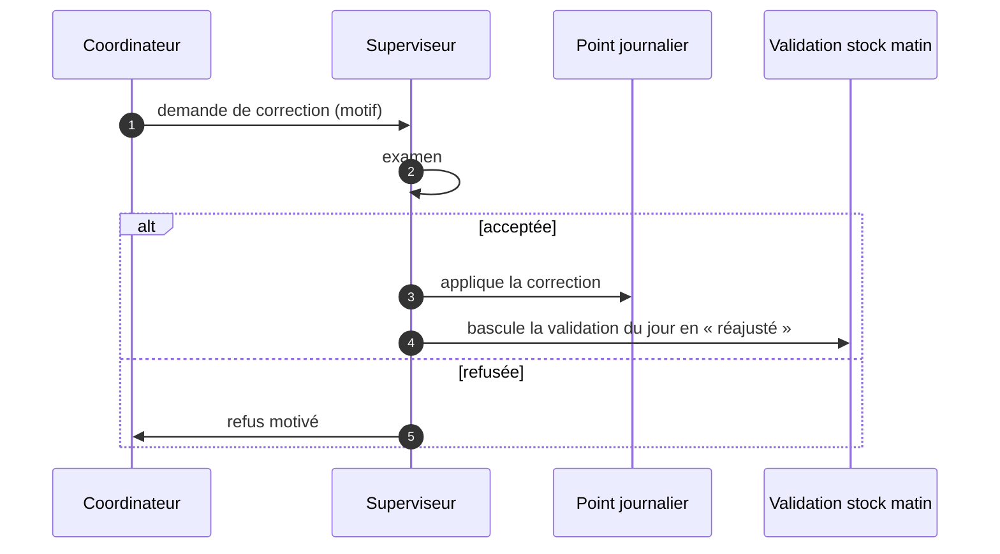
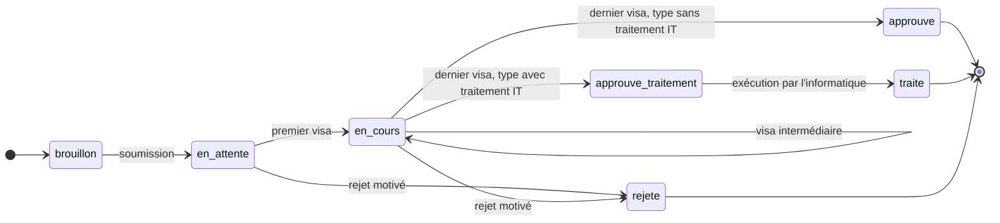
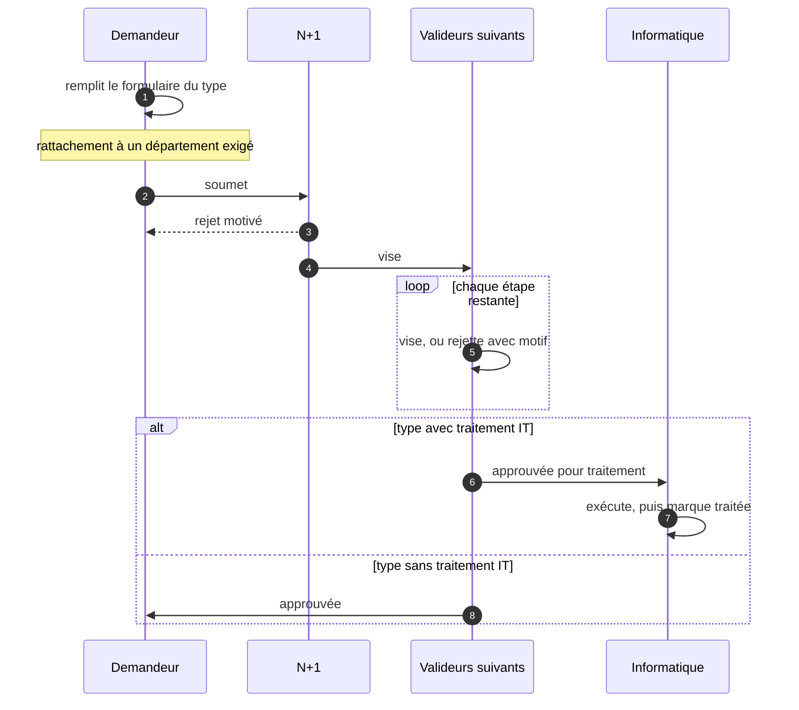
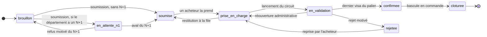
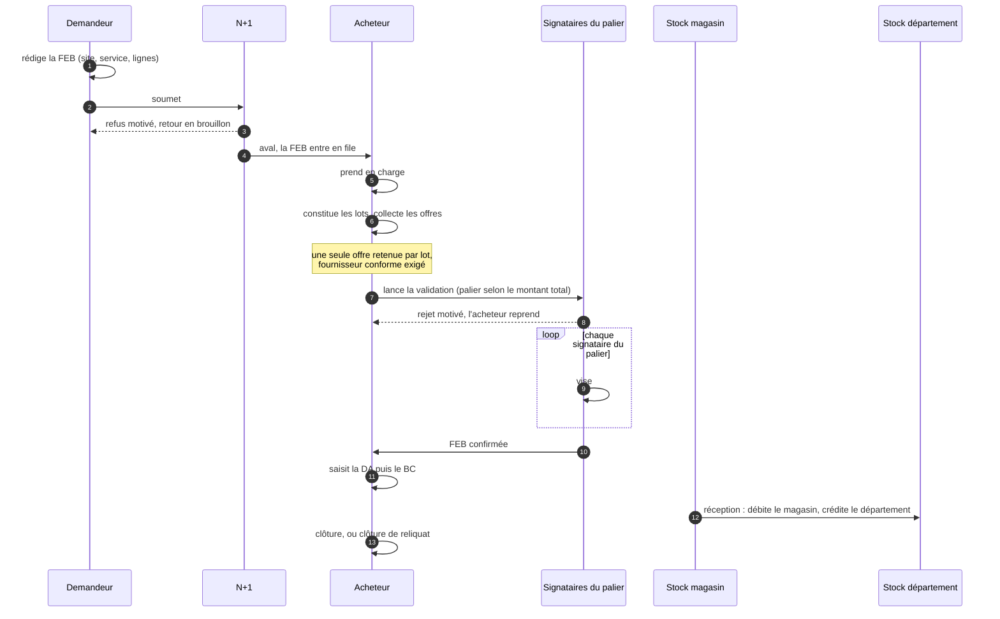

# Spécification fonctionnelle et technique — ERP EMUCI

**Version du logiciel** : branche `main`, commit `5ecb558` (29 août 2026)
**Version de la spécification** : 1.0
**Objet** : décrire ce que le système est, ses règles et ses limites.

> **Provenance.** Ce document est établi par lecture du code source et
> interrogation de la base. Chaque règle citée est vérifiable à l'endroit
> indiqué. Ce qui n'a pas pu être établi est signalé comme tel plutôt que
> comblé : voir la section 11.
>
> Ce document décrit le **comportement implémenté**, qui n'est pas
> nécessairement le comportement voulu. Là où le code signale lui-même une
> valeur provisoire, la spécification le répercute.

---

## Sommaire

1. [Objet et périmètre](#1-objet-et-périmètre)
2. [Architecture technique](#2-architecture-technique)
3. [Modèle de données](#3-modèle-de-données)
4. [Habilitations](#4-habilitations)
5. [Domaine Opérations](#5-domaine-opérations)
6. [Domaine Stock, bobines et inventaires](#6-domaine-stock-bobines-et-inventaires)
7. [Domaine Demandes internes](#7-domaine-demandes-internes)
8. [Domaine Achats](#8-domaine-achats)
9. [Domaine Informatique](#9-domaine-informatique)
10. [Services transverses](#10-services-transverses)
11. [Contraintes et points ouverts](#11-contraintes-et-points-ouverts)

---

## 1. Objet et périmètre

ERP EMUCI couvre la production de plaques d'immatriculation et la chaîne
logistique qui l'alimente, sur **vingt et un sites actifs**.

**Six domaines fonctionnels** :

| Domaine | Objet |
|---|---|
| Opérations | Relevé quotidien de production, rapprochement avec la plateforme nationale |
| Stock et bobines | Bobines de film, rivets, PMMA, consommables, équipements |
| Inventaires | Comptages physiques et traitement des écarts |
| Demandes internes | Demandes administratives dématérialisées et circuits de visa |
| Achats | De l'expression de besoin à la réception, avec contrôle budgétaire |
| Informatique | Interventions de maintenance et affectation du matériel |

**Hors périmètre** : la paie, la comptabilité générale (l'ERP produit une
imputation analytique, il ne tient pas les comptes), la facturation client.

---

## 2. Architecture technique

| Élément | Choix |
|---|---|
| Langage | PHP 8.2 (image `php:8.2-cli`) |
| Base de données | PostgreSQL 16, hébergée sur Neon |
| Hébergement applicatif | Render |
| Framework | **Aucun.** Pages PHP servies directement, logique dans `includes/` |
| Génération PDF | Dompdf 3.1 — seule dépendance applicative |
| Icônes | Phosphor Icons |

**Volumétrie du code** : 83 pages PHP servies, 14 modules de logique dans
`includes/`, dont les deux plus importants sont `achats.php` (80 fonctions,
2 762 lignes) et `dashboard.php` (25 fonctions, 2 047 lignes).

### 2.1 Conséquences de l'absence de framework

- Chaque page est un point d'entrée autonome. Le contrôle d'accès n'est donc
  **pas centralisé par un routeur** : il est posé page par page, par
  `require_auth()` puis `require_permission()`. Une page qui oublie l'appel
  est ouverte.
- Il n'y a ni ORM ni migrations versionnées automatiquement. Les évolutions
  de schéma sont des fichiers `sql/` appliqués à la main.
- Les échanges dynamiques passent par des requêtes AJAX rendant du JSON,
  détectées par `is_ajax()`.

---

## 3. Modèle de données

**105 tables**, réparties ainsi :

| Domaine | Tables | Principales |
|---|---|---|
| Bobines et films | 19 | `op_bobines`, `mouvements_bobines`, `bilans_mensuels_bobines`, `op_films_utilises` |
| Achats | 14 | `feb`, `feb_lignes`, `feb_offres`, `achat_paliers`, `familles_achat`, `lignes_budgetaires`, `budget_validations` |
| Demandes internes | 10 | `di_demandes`, `di_types`, `di_etapes`, `di_roles`, `di_plateformes` |
| Opérations | 9 | `op_points_journaliers`, `op_stock_rivets`, `op_types_vehicule`, `points_emuci` |
| Inventaires | 8 | `inventaires_bobines`, `inventaire_details_bobines`, `ecarts_bobines` et équivalents rivets, PMMA, équipements |
| Parc | 6 | `equipements`, `nomenclatures`, `affectations_equipements`, `interventions_maintenance` |
| Référentiel | 8 | `users`, `roles`, `permissions`, `sites`, `departements`, `user_departements`, `delegations`, `agents` |
| Autres | 31 | `articles`, `commandes`, `stock_site`, `stock_departement`, `notifications`, `audit_log`, imports EMUCI |

### 3.1 Trois notions de stock, à ne pas confondre

C'est la source d'erreur la plus probable pour qui découvre le modèle.

| Notion | Table | Portée |
|---|---|---|
| **Stock global d'un article** | `articles.stock_global` | Aucune ventilation par site |
| **Stock magasin** | `stock_site` filtré sur les sites de type `magasin` | Le stock central, source des livraisons d'achats |
| **Stock d'un département** | `stock_departement` | Ce qu'un service détient après réception |

Une réception d'achat **débite le magasin et crédite le département**. Le
stock global des articles, lui, n'est pas ventilé : c'est pourquoi un filtre
par site ne change pas le compte des alertes de stock.

---

## 4. Habilitations

### 4.1 Le modèle

**Seize rôles**, **trente-sept modules**, **cinq droits** par module :
`can_read`, `can_create`, `can_update`, `can_delete`, `can_export`.

La table `permissions` porte une ligne par couple (rôle, module).

### 4.2 La règle de repli, à connaître

> Un rôle dont **aucune** permission n'est renseignée n'est pas traité comme
> interdit : il voit le profil par défaut.

C'est délibéré — une configuration oubliée ne doit pas ressembler à un refus.
Vérifié en base le 2026-07-30 : cinq rôles étaient dans ce cas, dont
`lecteur`, `gestionnaire_stock_bobines` et `maintenance_info`.

**Conséquence de sécurité** : tant qu'un rôle n'a aucune permission, le
paramétrage ne le restreint pas. Le repli doit être vu comme une phase de
transition, pas comme un état stable.

### 4.3 Portées implicites

Deux restrictions ne passent pas par la table des permissions :

- **`coordinateur_site`** est verrouillé sur son site. Le paramètre d'URL est
  ignoré pour lui.
- **`maintenance_info`** est restreint à la catégorie d'équipements
  `informatique`.

### 4.4 Délégation

Un utilisateur peut déléguer ses visas à un autre pour une période donnée
(`delegations`). Sans cela, une demande reste bloquée à l'étape d'une
personne absente.

---

## 5. Domaine Opérations

### 5.1 Le point journalier

Entité centrale : `op_points_journaliers`. Un relevé porte un site, une date,
un type, et les quantités produites — véhicules par catégorie, plaques,
rivets utilisés et endommagés, heures de travail.

#### Cycle de vie

| Statut | Qui agit | Effet |
|---|---|---|
| `brouillon` | Coordinateur | Saisi, non transmis. **N'entre dans aucun agrégat.** |
| `en_attente_validation` | — | Transmis, attend le superviseur |
| `valide` | Superviseur | Compte dans tous les indicateurs |
| `rejete` | Superviseur | Refusé avec motif ; le coordinateur reprend |

> **Trois statuts, pas deux.** La distinction `brouillon` /
> `en_attente_validation` est structurante : un brouillon n'est visible que de
> son auteur, un point en attente est dans la file du superviseur. Les
> confondre fait chercher des points là où ils ne sont pas.

#### Correction d'un point validé

Un point `valide` n'est plus modifiable directement. La correction suit son
propre circuit :

**Effet de bord à connaître** : accepter une correction ne touche pas
seulement le point. La **validation du stock du matin** du même site et de la
même date passe au statut `reajuste`. Les deux domaines sont liés, parce
qu'un chiffre de production corrigé invalide le rapprochement de stock qui en
découlait.

### 5.2 Rapprochement EMUCI

**Import** (`import_optoplate`, `import_optotrace`, `import_sessions_emuci`) :
chargement du fichier de la plateforme nationale, donnant le nombre de
plaques par site et par `statut_plaque` (`in_use`, `declared_broken`, …).

Le fichier est refusé si des colonnes attendues manquent, avec la liste des
colonnes absentes.

**Point EMUCI** : compare le déclaré et le remonté, et expose les écarts.
Les sites présents dans le fichier mais inconnus de l'ERP sont isolés dans
`emuci_sites_inconnus` plutôt que rejetés.

---

## 6. Domaine Stock, bobines et inventaires

### 6.1 Cycle de vie d'une bobine

| Statut | Signification |
|---|---|
| `en_stock` | Reçue, non ouverte |
| `en_cours` | Ouverte, en consommation |
| `epuisee` | Films consommés |
| `retiree` | Sortie du circuit |

Une bobine porte `films_total`, `films_utilises`, `films_endommages`,
`films_restants`.

> **Seules les bobines `en_cours` comptent** dans les films restants affichés
> par les tableaux de bord.

### 6.2 Validation du stock du matin

Déclaration quotidienne par site (`validations_stock_matin`). Trois issues :
`valide`, `valide_avec_ecarts`, `valide_auto`. Le nombre d'écarts est stocké
(`nb_ecarts`) avec leur détail.

### 6.3 Rivets

`op_stock_rivets`, par site et par type. **Seuil d'alerte : 200 unités.** En
dessous, le site remonte dans les alertes.

### 6.4 Inventaires

Quatre inventaires indépendants — bobines, rivets, PMMA, équipements — bâtis
sur le même modèle : une table de session, une table de détail, une table
d'écarts.

Une session est en `brouillon` tant qu'elle n'est pas clôturée. L'écran
d'écarts compare le comptage physique au stock théorique.

`includes/inventaire.php` porte la création des sessions, avec un libellé de
période automatique.

---

## 7. Domaine Demandes internes

### 7.1 Structure

Un **type** (`di_types`) porte une liste ordonnée d'**étapes**
(`di_etapes`), chacune désignant un code de rôle valideur. Neuf types sont
actifs.

Les champs de formulaire ne sont pas en base : ils sont déclarés dans
`includes/demandes_champs.php`, et un moteur de rendu générique les affiche.

### 7.2 Workflow d'une demande

**La bifurcation finale dépend du type, pas de la demande.** Six types sur
neuf portent le drapeau `traitement_it` :

| Traitement IT requis | Types |
|---|---|
| Oui | Création d'accès NSIIV, basculement d'accès, basculement de compte, transfert d'agent, création de site, changement de géolocalisation |
| Non | Autorisation d'absence, imputation courrier, demande exceptionnelle |

Pour les six premiers, **approuvé ne suffit pas** : la demande reste à faire
tant que l'informatique ne l'a pas marquée traitée (`traite_it`), avec
éventuellement un numéro de ticket GLPI.

#### Le déroulé, acteur par acteur

#### Garde-fous

| Garde | Effet si non satisfaite |
|---|---|
| Le demandeur est rattaché à un département | Soumission refusée, message explicite |
| L'utilisateur n'est pas le demandeur | Impossible de viser sa propre demande |
| La demande est en `en_attente` ou `en_cours` | Toute autre tentative de visa est rejetée |
| Un rejet porte un motif | Rejet refusé sans motif |

### 7.3 Résolution des valideurs

Implémentée dans `di_user_roles()` et `di_can_validate()`.

| Rôle ERP | Étapes visables |
|---|---|
| `raf` | `raf` |
| `daf` | `daf` |
| `support_it`, `superviseur_it`, `maintenance_info` | `it` |
| `directeur_general`, `lecteur` | `dg` |
| `admin`, `superadmin` | toutes |

**Trois règles complémentaires :**

1. **`n1` n'est pas un rôle** : c'est le responsable du département du
   demandeur, résolu dynamiquement.
2. **Une étape rattachée à un département** (`di_roles.departement_id`) peut
   être visée par n'importe quel membre de ce département. C'est ce qui fait
   vivre le visa « Administration », dont le rôle ERP a été supprimé.
3. **Personne ne vise sa propre demande**, administrateurs compris.

### 7.4 Prérequis de dépôt

Un utilisateur doit être **rattaché à un département** pour soumettre. Sans
rattachement, le N+1 est introuvable et la soumission est refusée avec un
message explicite. Les administrateurs sont exemptés.

---

## 8. Domaine Achats

Le domaine le plus riche : 80 fonctions, 14 tables. Il porte des **règles de
gestion numérotées** dans le code, reprises ici.

### 8.1 Workflow d'une FEB

C'est le circuit le plus long du produit : **huit statuts**, quatre acteurs,
et trois portes de retour en arrière.

> **Le statut `en_attente_n1` conditionne tout le reste.** Sans l'aval du
> supérieur hiérarchique, le service achats ne voit même pas la demande. La
> personne est **figée** sur la fiche à la soumission (RG-11) : un changement
> de responsable en cours de circuit ne déplace pas une signature attendue.

#### Qui agit, et sur quoi

| Transition | Acteur | Garde |
|---|---|---|
| Soumission | Demandeur | Trois familles au maximum (RG-02) |
| Aval ou refus | N+1 figé sur la fiche | — |
| Prise en charge | Acheteur | `acheteur_id` vide **et** statut `soumise` |
| Restitution | Le même acheteur | Statut `prise_en_charge` |
| Réattribution | Responsable | Statut `prise_en_charge` |
| Lancement de la validation | Acheteur | Une offre retenue par lot, fournisseurs conformes, un palier couvre le montant |
| Visa | Signataires du palier | Ne pas être le demandeur |
| Reprise après rejet | Le même acheteur | Statut `rejetee` |
| Réouverture | Administrateur | Statut `en_validation` — annule les signatures, tracé |
| Bascule en commande | Acheteur | Statut `confirmee` |

#### Le déroulé complet

#### Les trois retours en arrière

Un circuit qui ne sait que remonter est un circuit qui bloque. Trois portes
de sortie existent, chacune avec sa condition :

| Porte | Depuis | Vers | Réservée à | Effet |
|---|---|---|---|---|
| Refus du N+1 | `en_attente_n1` | `brouillon` | Le N+1 figé | Le demandeur corrige et resoumet |
| Reprise après rejet | `rejetee` | `prise_en_charge` | L'acheteur en charge | Les signatures sont remises à zéro |
| Réouverture | `en_validation` | `prise_en_charge` | Administrateur seul | Annule les signatures, tracé explicitement |

La troisième est **la seule porte de sortie d'une FEB en cours de
validation** : offres et montants y sont verrouillés (RG-12).

### 8.2 Les huit statuts

| Statut | Signification |
|---|---|
| `brouillon` | En rédaction par le demandeur |
| `en_attente_n1` | Attend l'aval du supérieur hiérarchique |
| `soumise` | En file, aucun acheteur attribué |
| `prise_en_charge` | Un acheteur se l'est attribuée |
| `en_validation` | Dans le circuit de visas, montants verrouillés |
| `confirmee` | Validée, prête à commander |
| `cloturee` | Terminée |
| `rejetee` | Refusée à une étape, avec motif |

Trois niveaux d'urgence : normale, urgente, critique. Le numéro est attribué
automatiquement, par exercice.

### 8.3 Les règles de gestion

| Règle | Énoncé | Où |
|---|---|---|
| **RG-02** | Trois codes analytiques au maximum par FEB. En pratique, trois familles distinctes. | `feb_fiche.php` |
| **RG-05** | Le code analytique n'est jamais saisi à la main, toujours dérivé. | `achats.php` |
| **RG-06** | Le site et le service sont constants sur toute la FEB. | `achats.php` |
| **RG-08** | Un lot est identifié par son code analytique, sans second identifiant. | `achats.php` |
| **RG-09** | Une ligne peut être en dérogation : son fournisseur diffère de l'offre retenue du lot, et elle est exclue de la comparaison. | `achats.php` |
| **RG-10** | Le circuit de visa se calcule sur le **montant total de la FEB**, jamais par ligne ni par lot. | `achats.php` |
| **RG-11** | Le N+1 est résolu et **figé** sur la FEB (`n1_user_id`) : un changement de responsable en cours de circuit ne déplace pas une signature attendue. | `achats.php` |
| **RG-12** | Offres et montants sont verrouillés dès `en_validation`. Seul un administrateur peut rouvrir, ce qui annule les signatures et laisse une trace. | `achats.php` |
| **RG-13** | La grille des paliers actifs doit couvrir toute la plage de montants, **sans trou ni chevauchement**. Contrôlé à l'enregistrement et à la désactivation. | `param_paliers.php` |

### 8.4 Le code analytique

`SITE / DÉPARTEMENT / FAMILLE`, composé des trois codes, en majuscules et
sans espaces. Vide si l'un des trois manque.

Chaque famille porte un **compte comptable SYSCOHADA** : trente-cinq
familles installées, toutes rattachées à un compte (241 outillage, 2442
équipements, 604 consommables, 605 fournitures, 611 transport, 624
maintenance, 628 télécoms, …).

### 8.5 Circuit de visa par palier

Un palier associe une tranche de montant à des signataires.

| Montant (XOF) | Palier | Signataires |
|---|---|---|
| 0 à 500 000 | RAF seul | RAF |
| 500 001 à 5 000 000 | RAF + DAF | RAF, DAF |
| Au-delà de 5 000 000 | RAF + DAF + PDG | RAF, DAF, PDG |

> **Ces bornes sont provisoires.** La migration qui les installe les qualifie
> de « bornes de démarrage arbitraires, aucun seuil réel fourni ». Le
> mécanisme est en place ; les seuils ne sont pas arrêtés.

**Le visa du N+1 intervient avant la prise en charge par les achats** : sans
son aval, le service achats ne voit pas la demande (RG-11).

### 8.6 Conformité fournisseur

Un fournisseur n'est retenu que s'il porte **trois pièces** :

| Pièce | Champ |
|---|---|
| RCCM | `doc_rccm` |
| DFE / identification fiscale | `doc_dfe` |
| RIB / attestation bancaire | `doc_rib` |

Une pièce manquante bloque la retenue de l'offre.

### 8.7 Lots et comparatif d'offres

Une FEB se découpe en **lots**, un par code analytique (RG-08). Chaque lot
reçoit des offres (`feb_offres`), dont **une seule est retenue**.

**Contrôle bloquant** : un lot sans offre retenue empêche la poursuite. Sans
ce contrôle, un lot pouvait passer en validation avec des lignes à 0 XOF et
sans fournisseur.

Retenir une offre reporte le fournisseur sur les lignes du lot, **sauf les
lignes en dérogation** (RG-09).

### 8.8 Contrôle budgétaire

Une **ligne budgétaire** porte un code comptable, un exercice, une enveloppe
et un **comportement**. La situation d'une ligne distingue l'**engagé**, le
**réservé** et le **disponible**.

La validation d'un budget de département suit son propre circuit
(`budget_validations`) : soumission, validation ou rejet motivé, avec
réouverture administrative possible.

> **Aucune enveloppe n'est renseignée.** Les six lignes installées ont une
> enveloppe vide, donc aucun plafond n'est effectif, et le comportement est
> `alerte` — jamais bloquant.

### 8.9 Suivi et réception

Après confirmation, la FEB devient une commande suivie.

| Statut de suivi | Signification |
|---|---|
| `en_attente` | Pas encore commandé |
| `commande` | Bon de commande émis |
| `en_retard` | Délai dépassé |
| `livree` | Marchandise arrivée |
| `receptionnee` | Contrôlée et entrée en stock |

La réception **débite le stock magasin** et **crédite le stock du
département** demandeur. Le débit pose un verrou sur les lignes de stock :
deux expéditions simultanées du même article ne peuvent pas lire le même
disponible.

Un reliquat peut être clôturé explicitement.

### 8.10 File d'attente et ancienneté

Une FEB soumise attend en file. Un acheteur la **prend en charge**, peut la
**restituer**, ou un responsable peut la **réattribuer**.

**L'ancienneté est calculée en heures ouvrées** : une fiche déposée vendredi
soir n'est pas comptée en retard le lundi matin.

### 8.11 Affectation des équipements achetés

Un équipement réceptionné suit un circuit propre : proposition
d'affectation, visa, puis confirmation de réception par le destinataire. Les
équipements entre les deux sont « en transit ».

---

## 9. Domaine Informatique

### 9.1 Interventions

`interventions_maintenance` porte le technicien, le site, l'équipement, le
problème signalé, les travaux effectués, les pièces changées, la durée en
minutes et un rapport en pièce jointe.

| Statut après intervention | Signification |
|---|---|
| `en_attente` | Déclarée, non traitée |
| `en_cours` | Prise en charge |
| `partiel` | Traitée partiellement |
| `resolu` | Terminée |

### 9.2 Parc et fin de cycle

Un équipement porte un état (`neuf`, `bon`, `usage`, `reforme`), une date de
mise en service et une **date de fin de cycle**, dérivée de la durée de vie
portée par sa nomenclature.

**Seuil d'alerte : 30 jours**, appliqué sur le tableau de bord et sur
l'écran des équipements. L'écran des rapports propose en outre une vue à
90 jours.

### 9.3 Transfert d'équipement

Recherche par numéro de série, destination, motif obligatoire. Tracé dans
`mouvements_equipements`. Requiert le droit de **création** sur
`affectations` — la lecture ne suffit pas.

---

## 10. Services transverses

### 10.1 Notifications

Deux canaux distincts :

- **En application** : table `notifications`, cloche avec compteur de non-lus
  dans la barre du haut.
- **Par e-mail** : `mailer_send()`, avec configuration SMTP ou API Brevo
  éditable depuis l'administration.

### 10.2 Journal d'audit

`audit_log`, alimenté par `audit_log()`. Trace qui a fait quoi et quand. Un
compte désactivé n'est jamais supprimé, précisément pour que sa trace reste
exploitable.

### 10.3 Documents PDF

Dompdf. Trois documents pour les achats — fiche seule, fiche avec circuit de
validation, bon de commande — et l'impression du point journalier.

### 10.4 Authentification

- Mot de passe haché (`password_hash`).
- **Changement imposé** (`must_change_password`) après création de compte ou
  réinitialisation par un administrateur : toute page redirige vers l'écran
  de changement, et les requêtes AJAX sont refusées, tant qu'il n'est pas
  fait.
- Réinitialisation en libre-service par jeton envoyé par e-mail
  (`reset_token`, `reset_token_expiry`), qui lève la contrainte.
- Les mots de passe sont nettoyés de leurs espaces de bord à la saisie comme
  à la connexion, un collage depuis un e-mail en traînant souvent.

---

## 11. Contraintes et points ouverts

### 11.1 Valeurs provisoires, signalées par le code lui-même

| Point | En place | Manquant | Risque |
|---|---|---|---|
| Paliers de validation | Trois paliers fonctionnels | Les seuils réels | Une FEB peut suivre un circuit qui ne correspond pas à la règle de l'entreprise |
| Enveloppes budgétaires | Six lignes, comportement `alerte` | Tous les montants | Aucun dépassement n'est détecté |
| Types d'achat | DAF, DAI, DAH | Le développé exact des sigles | Cosmétique |

### 11.2 Dettes structurelles

1. **Contrôle d'accès non centralisé.** Sans routeur, chaque page pose sa
   propre barrière, et l'oubli ne se voit pas. Deux campagnes de reprise en
   témoignent : `43b1d1e` a remplacé les contrôles en dur par
   `require_permission()` sur dix-sept pages, et `ed37027`, le 29 août, a
   réaligné sept pages de plus — certaines ignoraient jusque-là totalement la
   table des permissions.
2. **Repli des rôles sans permission** (4.2). Utile en transition, dangereux
   s'il s'installe.
3. **Fichiers SQL en syntaxe MySQL.** Trois fichiers de `sql/` ne sont pas
   applicables sur PostgreSQL. Leur contenu est couvert par le dump
   PostgreSQL, mais leur présence est trompeuse.
4. **Deux pages de profil** coexistent, `mon_profil.php` et `profil.php`, la
   seconde n'étant presque plus référencée.

### 11.3 Ce que cette spécification n'établit pas

- **Les volumes cibles et la performance attendue.** Aucun objectif chiffré
  n'est inscrit dans le code.
- **La politique de sauvegarde et de restauration.**
- **Les exigences de conformité** applicables aux données personnelles des
  agents.
- **Le comportement voulu** là où il diffère du comportement implémenté.
  Cette spécification décrit le second.

---

## Suivi des versions

| Version | Date | Base logicielle | Modifications |
|---|---|---|---|
| 1.0 | 2026-08-29 | `5ecb558` | Première édition |
