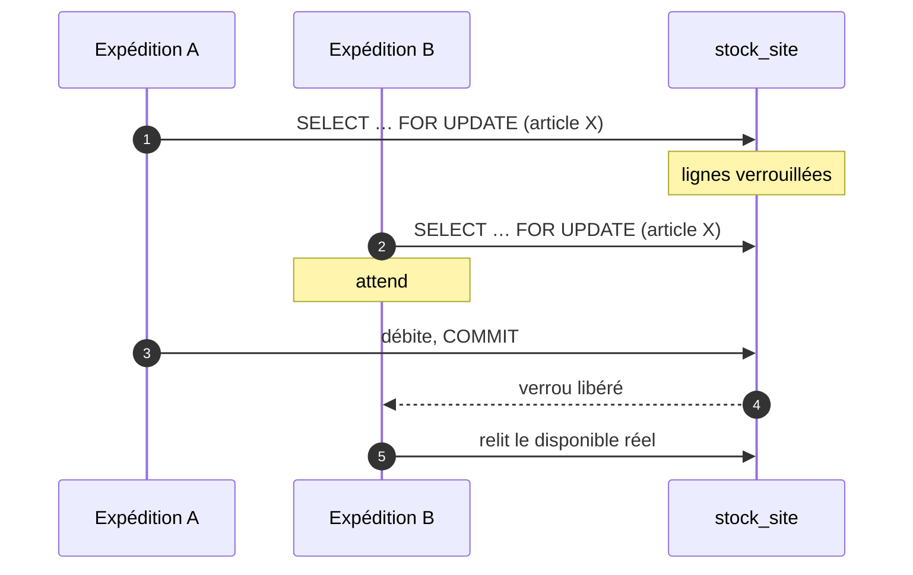
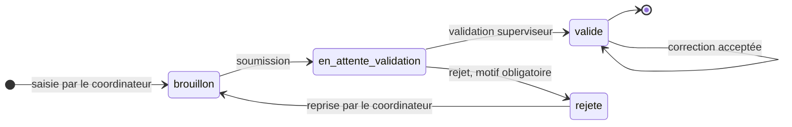
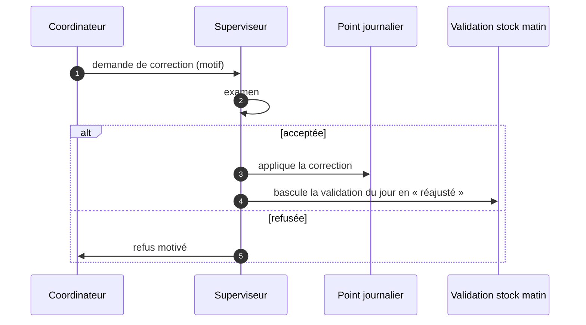
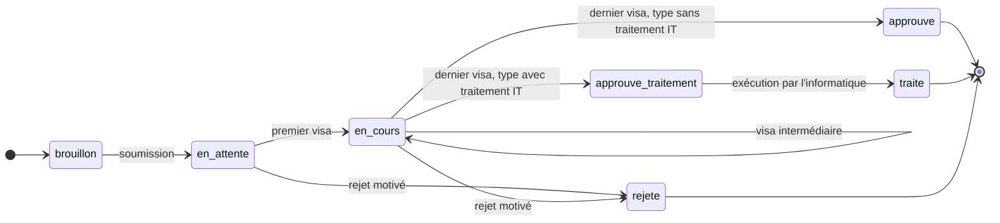
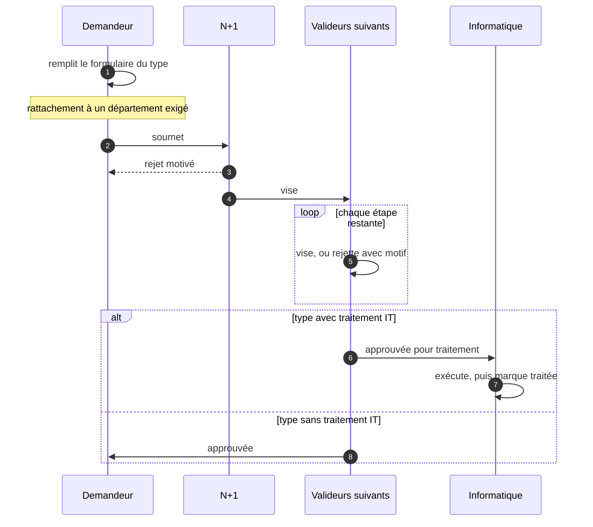
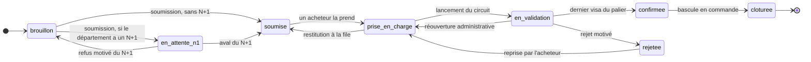
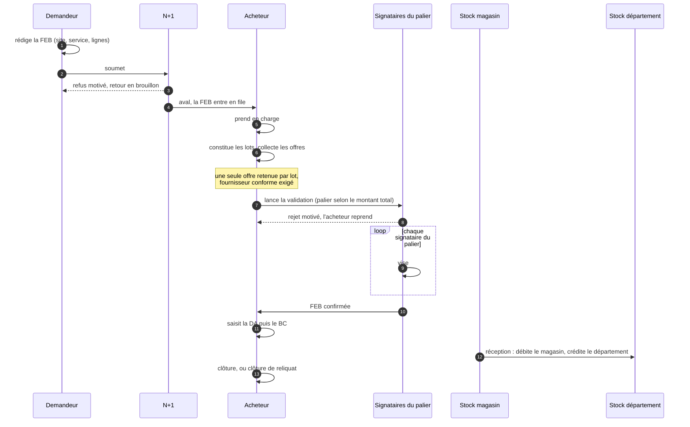

# Spécification fonctionnelle et technique — ERP EMUCI

**Version du logiciel** : branche `main`, commit `5ecb558` (29 août 2026)
**Version de la spécification** : 2.1
**Objet** : décrire ce que le système est, comment il est construit, les
règles qu'il applique et les limites qu'il porte.

> **Provenance.** Établie par lecture du code source et interrogation de la
> base. Chaque chiffre et chaque règle cités sont vérifiables à l'endroit
> indiqué.
>
> Ce document décrit le **comportement implémenté**, qui n'est pas
> nécessairement le comportement voulu. Là où le code signale lui-même une
> valeur provisoire, la spécification le répercute.

---

## Sommaire

**Partie I — Technique**

1. [Objet et périmètre](#1-objet-et-périmètre)
2. [Architecture d'exécution](#2-architecture-dexécution)
3. [Modèle de données](#3-modèle-de-données)
4. [Transactions et concurrence](#4-transactions-et-concurrence)
5. [Sécurité](#5-sécurité)
6. [Exploitation](#6-exploitation)

**Partie II — Fonctionnel**

7. [Habilitations](#7-habilitations)
8. [Domaine Opérations](#8-domaine-opérations)
9. [Domaine Stock, bobines et inventaires](#9-domaine-stock-bobines-et-inventaires)
10. [Domaine Demandes internes](#10-domaine-demandes-internes)
11. [Domaine Achats](#11-domaine-achats)
12. [Domaine Informatique](#12-domaine-informatique)
13. [Services transverses](#13-services-transverses)
14. [Contraintes et points ouverts](#14-contraintes-et-points-ouverts)

---

# Partie I — Technique

## 1. Objet et périmètre

ERP EMUCI couvre la production de plaques d'immatriculation et la chaîne
logistique qui l'alimente, sur **vingt et un sites actifs**.

| Domaine | Objet |
|---|---|
| Opérations | Relevé quotidien de production, rapprochement avec la plateforme nationale |
| Stock et bobines | Bobines de film, rivets, PMMA, consommables, équipements |
| Inventaires | Comptages physiques et traitement des écarts |
| Demandes internes | Demandes administratives et circuits de visa |
| Achats | De l'expression de besoin à la réception, avec contrôle budgétaire |
| Informatique | Interventions de maintenance et affectation du matériel |

**Hors périmètre** : la paie, la comptabilité générale — l'ERP produit une
imputation analytique, il ne tient pas les comptes — et la facturation
client.

---

## 2. Architecture d'exécution

### 2.1 Pile technique

| Élément | Choix | Précision |
|---|---|---|
| Runtime | PHP 8.2 | Image `php:8.2-cli`, serveur web intégré |
| Base | PostgreSQL 16 | Hébergée sur Neon |
| Hébergement | Render | Conteneur bâti depuis le `Dockerfile` du dépôt |
| Accès données | PDO natif | Aucun ORM |
| PDF | Dompdf 3.1 | **Seule dépendance applicative** du `composer.json` |
| Extensions PHP | pdo_pgsql, gd (freetype, jpeg) | gd requis par Dompdf |

### 2.2 Il n'y a pas de framework, et cela se paie

C'est le choix structurant. Quatre conséquences directes :

**1. Pas de routeur, donc pas de point de contrôle unique.** Chaque page est
un point d'entrée autonome qui pose lui-même sa barrière :

```php
require_auth();                              // session valide
require_permission('bobines', 'can_read');   // droit sur le module
```

Une page qui omet le second appel est ouverte à tout compte authentifié. Ce
n'est pas théorique : deux campagnes de reprise ont été nécessaires,
`43b1d1e` sur dix-sept pages puis `ed37027` sur sept de plus, dont certaines
ignoraient jusque-là totalement la table des permissions.

**2. Pas d'ORM.** Les requêtes sont écrites à la main, via douze fonctions
utilitaires dans `includes/db.php` (`db_query`, `db_fetch_all`,
`db_fetch_one`, `db_fetch_value`, `db_begin`, `db_commit`, `db_rollback`…).
372 appels passent des paramètres liés.

**3. Pas de migrations versionnées.** Les évolutions de schéma sont des
fichiers dans `sql/`, appliqués manuellement. Rien ne garantit qu'un
environnement les a toutes reçues, ni dans quel ordre.

**4. La logique métier vit dans `includes/`**, pas dans des modèles.

| Module | Fonctions | Lignes |
|---|---|---|
| `achats.php` | 80 | 2 762 |
| `dashboard.php` | 25 | 2 047 |
| `groupes_config.php` | 5 | 580 |
| `demandes.php` | 25 | 534 |
| `pdf_achats.php` | 4 | 458 |
| `session.php` | 16 | 327 |
| `demandes_champs.php` | 7 | 318 |
| `auth.php` | 9 | 272 |
| `inventaire.php` | 7 | 219 |
| `upload.php` | 10 | 199 |

`achats.php` concentre à lui seul un tiers de la logique métier.

### 2.3 Connexion à la base

PDO est configuré en **exceptions** (`PDO::ERRMODE_EXCEPTION`) et en tableaux
associatifs (`PDO::FETCH_ASSOC`).

Une exception PDO non rattrapée produit donc une erreur fatale et une page
blanche. C'est ce qui s'est produit sur la vue exécutive quand un filtre par
site référençait une colonne inexistante : la page entière tombait.

**Corollaire de conception** : tout appel de données dans un contexte
composite — un tableau de bord fait de blocs — doit être enveloppé. Le
registre du tableau de bord le fait, et journalise l'échec plutôt que de le
laisser remonter.

### 2.4 Contrat des échanges dynamiques

Toutes les réponses AJAX ont la même forme, produite par `json_response()` :

```json
{ "success": true, "message": "…", "data": { } }
```

`success` porte le résultat, `message` est destiné à l'affichage,
`data` transporte la charge utile. Une requête AJAX est reconnue par
`is_ajax()`, et les pages servent alors du JSON là où elles rendraient du
HTML.

**Conséquence sur le contrôle d'accès** : une barrière qui redirige convient
à une navigation, pas à une requête AJAX — le client recevrait du HTML là où
il attend du JSON. `require_auth()` traite les deux cas séparément.

### 2.5 Configuration

La configuration est portée par des constantes (`APP_URL`, `APP_NAME`,
`APP_TIMEZONE`, `APP_VERSION`, `DB_HOST`, `DB_NAME`, `DB_PASS`…), avec
`DATABASE_URL` pour la connexion hébergée.

---

## 3. Modèle de données

**105 tables.**

| Domaine | Tables | Principales |
|---|---|---|
| Bobines et films | 19 | `op_bobines`, `mouvements_bobines`, `bilans_mensuels_bobines` |
| Achats | 14 | `feb`, `feb_lignes`, `feb_offres`, `feb_suivi`, `achat_paliers`, `familles_achat` |
| Demandes internes | 10 | `di_demandes`, `di_types`, `di_etapes`, `di_roles` |
| Opérations | 9 | `op_points_journaliers`, `op_stock_rivets`, `points_emuci` |
| Inventaires | 8 | Session, détail et écarts, pour chacun des quatre inventaires |
| Parc | 6 | `equipements`, `nomenclatures`, `interventions_maintenance` |
| Référentiel | 8 | `users`, `roles`, `permissions`, `sites`, `departements`, `agents` |
| Autres | 31 | `articles`, `stock_site`, `stock_departement`, `notifications`, `audit_log` |

### 3.1 Indexation

**124 index** dans le dump principal, seize de plus apportés par les
migrations du module achats.

### 3.2 Le circuit stocké sur la demande

Le circuit de validation ne se stocke pas en lignes : il vit sur la demande
elle-même, sérialisé en JSON. Trois colonnes, présentes à l'identique dans
les demandes internes, les FEB et les affectations d'équipement.

| Colonne | Contenu |
|---|---|
| `workflow_snapshot` | Le circuit **figé** au lancement de la validation |
| `signatures` | La liste des visas donnés, avec auteur, date et commentaire |
| `historique` | La trace des actions |

**C'est un choix délibéré, avec une raison précise** : une demande transporte
sa propre copie du circuit. Modifier un type de demande ne réécrit donc pas
l'histoire des demandes en cours. Le prix à payer est qu'on ne peut pas
interroger les visas en SQL aussi simplement qu'une table de jointure.

Le **type de colonne diffère selon le module** : voir 3.5.

### 3.3 Trois notions de stock, à ne pas confondre

C'est la source d'erreur la plus probable pour qui découvre le modèle.

| Notion | Table | Portée |
|---|---|---|
| Stock global d'un article | `articles.stock_global` | Aucune ventilation par site |
| Stock magasin | `stock_site`, sites de type `magasin` | Stock central, source des livraisons d'achats |
| Stock d'un département | `stock_departement` | Ce qu'un service détient après réception |

Une réception d'achat **débite le magasin et crédite le département**. Le
stock global des articles n'est pas ventilé : c'est pourquoi un filtre par
site ne change pas le compte des alertes de stock.

### 3.4 Dictionnaire des tables centrales

Sept tables portent l'essentiel du produit. Leurs colonnes structurantes,
leurs clés et leurs contraintes.

#### `users` — comptes

| Colonne | Type | Note |
|---|---|---|
| `id` | integer | Clé primaire |
| `nom`, `prenom`, `email` | varchar | `email` sert d'identifiant de connexion |
| `password_hash` | varchar | bcrypt, coût 12 |
| `role_id` | integer | → `roles.id` |
| `site_id` | integer | Site de rattachement, verrouille le coordinateur |
| `actif` | smallint | Un compte désactivé n'est jamais supprimé |
| `must_change_password` | smallint | Bloque toute page tant qu'il vaut 1 |
| `reset_token`, `reset_token_expiry` | varchar, timestamp | Réinitialisation en libre-service |

#### `permissions` — habilitations

| Colonne | Type | Note |
|---|---|---|
| `role_id` | integer | → `roles.id` |
| `module` | varchar | Un des trente-sept modules |
| `can_create`, `can_read`, `can_update`, `can_delete`, `can_export` | smallint | 0 ou 1 |

**Unicité sur `(role_id, module)`** : un rôle a au plus une ligne par module.
C'est ce qui rend `ON CONFLICT` utilisable dans les migrations de droits.

#### `op_points_journaliers` — le relevé quotidien

| Colonne | Type | Note |
|---|---|---|
| `site_id` | integer | → `sites.id` |
| `date_point` | date | Avec `site_id` et `type_point`, identifie le relevé |
| `type_point`, `statut` | text | `brouillon`, `en_attente_validation`, `valide`, `rejete` |
| `nb_vp`, `nb_camion`, `nb_semi`, `nb_moto` | integer | Détail par catégorie |
| `total_engins`, `total_plaques` | integer | Agrégats saisis |
| `rivets_utilises`, `rivets_endommages` | integer | |
| `created_by`, `validated_by` | integer | → `users.id` |
| `motif_rejet` | text | Obligatoire au rejet |

#### `op_bobines` — bobines de film

| Colonne | Type | Note |
|---|---|---|
| `numero` | varchar | **Unique** |
| `type_code`, `serie` | varchar | |
| `type_vehicule_id` | integer | → `op_types_vehicule.id` |
| `films_total`, `films_utilises`, `films_endommages`, `films_restants` | integer | `films_restants` est stocké, pas calculé à la volée |
| `site_id` | integer | → `sites.id` |
| `statut` | text | `en_stock`, `en_cours`, `epuisee`, `retiree` |

#### `di_demandes` — demandes internes

| Colonne | Type | Note |
|---|---|---|
| `numero` | varchar | **Unique** |
| `type_code` | varchar | → `di_types.code` |
| `statut`, `etape_actuelle`, `etape_rejet` | varchar, integer | Position dans le circuit |
| `demandeur_id`, `n1_user_id`, `traite_par` | integer | → `users.id` |
| `site_id` | integer | → `sites.id` |
| `champs` | **text** | Les valeurs du formulaire, en JSON |
| `workflow_snapshot`, `signatures`, `historique` | **text** | Le circuit figé, les visas, la trace |
| `traite_it` | smallint | Exécution informatique effectuée |

#### `feb` — expression de besoin

| Colonne | Type | Note |
|---|---|---|
| `numero` | varchar | **Unique**, attribué par exercice |
| `exercice` | integer | |
| `demandeur_id`, `acheteur_id`, `n1_user_id` | integer | → `users.id` |
| `site_id`, `departement_id` | integer | Constants sur toute la FEB (RG-06) |
| `urgence` | smallint | 0 normale, 1 urgente, 2 critique |
| `statut` | varchar | Les huit statuts |
| `montant_total` | **bigint** | En XOF, entier — pas de flottant |
| `workflow_snapshot`, `signatures`, `historique` | **jsonb** | |

#### `feb_lignes` — lignes d'une FEB

| Colonne | Type | Note |
|---|---|---|
| `feb_id` | integer | → `feb.id` |
| `numero_ligne` | integer | |
| `designation` | varchar | |
| `article_id`, `famille_id`, `fournisseur_id`, `nomenclature_id` | integer | Références au référentiel |
| `type_achat` | varchar | → `achat_types.code` |
| `code_analytique` | varchar | Dérivé, jamais saisi (RG-05) |
| `lot` | varchar | Égal au code analytique (RG-08) |
| `montant_ttc` | **bigint** | En XOF |

### 3.5 Deux observations sur les types

**Les montants sont des entiers (`bigint`), jamais des flottants.** Un
montant en XOF n'a pas de sous-unité : le stocker en entier évite les erreurs
d'arrondi qu'un `float` introduirait sur les cumuls et les comparaisons de
paliers.

> **Incohérence entre deux modules.** `feb` et `equipement_affectations`
> stockent leurs circuits en **`jsonb`** ; `di_demandes`, plus ancien, les
> stocke en **`text`**. Même structure, deux types. Le module des demandes
> internes se prive donc des opérateurs JSON de PostgreSQL : on ne peut pas y
> interroger un visa directement en SQL, il faut décoder côté PHP.

---

## 4. Transactions et concurrence

### 4.1 Où les transactions sont posées

`db_begin()` / `db_commit()` / `db_rollback()` sont appelées dans
**vingt-six fichiers**, principalement là où plusieurs tables changent
ensemble : création d'une FEB (en-tête, lignes, pièces jointes), saisie d'un
inventaire, mouvements de bobines, réceptions, validation du stock du matin.

Le motif est constant : une seule transaction, et `db_rollback()` sur
exception.

### 4.2 Verrouillage explicite

**Neuf `SELECT … FOR UPDATE`** dans le code. Le cas le plus significatif est
le débit du stock magasin lors d'une réception d'achat :



Sans ce verrou, deux expéditions simultanées du même article liraient le même
disponible et le débiteraient chacune de leur côté.

### 4.3 Courses évitées par la condition de mise à jour

Plusieurs transitions ne se contentent pas de vérifier avant d'écrire : elles
**portent la condition dans le `WHERE`**, ce qui rend la course impossible
plutôt que peu probable.

```sql
UPDATE feb SET acheteur_id = ?, statut = 'prise_en_charge'
 WHERE id = ? AND acheteur_id IS NULL AND statut = 'soumise'
```

Deux acheteurs cliquant en même temps : le second ne met à jour aucune ligne
et reçoit un échec, plutôt que d'écraser l'attribution du premier. Le même
motif protège la restitution (`AND acheteur_id = ?`), la reprise après rejet
et la réouverture administrative.

---

## 5. Sécurité

### 5.1 Authentification

| Élément | Mise en œuvre |
|---|---|
| Hachage | `password_hash()` en **bcrypt, coût 12** |
| Changement imposé | `must_change_password` — bloque toute page tant qu'il n'est pas fait |
| Réinitialisation | Jeton en base avec date d'expiration (`reset_token`, `reset_token_expiry`) |
| Nettoyage | Les espaces de bord sont retirés à la saisie **et** à la connexion |

Le nettoyage des espaces n'est pas cosmétique : un mot de passe collé depuis
un e-mail avec une espace de fin était enregistré tel quel puis refusé à la
connexion, ce qui bloquait le compte.

### 5.2 Session

| Paramètre | Valeur |
|---|---|
| `cookie_httponly` | `true` — le cookie est hors de portée du JavaScript |
| `cookie_samesite` | `Lax` |
| `cookie_secure` | Activé **si** la requête arrive en HTTPS |
| Inactivité | **900 secondes**, soit quinze minutes |

La déconnexion pour inactivité est un garde-fou serveur, tracé dans le
journal d'audit.

### 5.3 Injection SQL

**Aucune superglobale n'est interpolée dans une requête.** Vérifié par
balayage de tous les fichiers PHP du dépôt : zéro occurrence de `$_GET`,
`$_POST` ou `$_REQUEST` à l'intérieur d'une chaîne SQL.

Deux mécanismes coexistent :

| Mécanisme | Usage | Sûreté |
|---|---|---|
| Paramètres liés | 372 appels | Sûr par construction |
| Fragment `AND colonne = valeur` | Filtres de portée | **Sûr uniquement parce que la valeur est castée en entier** à la lecture |

> **Le point de fragilité est le second mécanisme.** Sa sûreté ne tient pas à
> la requête mais à un `(int)` posé plus haut, souvent dans un autre fichier.
> Le jour où un filtre portera une chaîne — un code de site, un statut — le
> motif se retournera silencieusement. L'aide partagée
> `dash_filtre_site()` montre la bonne façon de faire : elle renvoie un
> fragment **paramétré**, `AND colonne = ?`, avec sa valeur à part.

### 5.4 Injection HTML

L'échappement passe par l'aide `h()`, appliquée à toute donnée rendue.

### 5.5 Téléversements

| Contrôle | Valeur |
|---|---|
| Taille maximale | 10 Mo |
| Types admis | `application/pdf`, `image/jpeg`, `image/png`, `image/webp` |
| Vérification | **`finfo` sur le contenu**, pas l'extension du nom |

Vérifier le type réel plutôt que l'extension est le bon choix : un `.pdf`
renommé ne passe pas.

### 5.6 Ce qui n'est pas en place

> **Aucune protection CSRF.** Aucun jeton anti-rejeu n'est émis ni vérifié.
> Le cookie de session étant en `SameSite=Lax`, les requêtes intersites en
> `POST` ne l'emportent pas, ce qui couvre le cas ordinaire. Mais la
> protection repose entièrement sur ce comportement du navigateur, et non sur
> une vérification applicative.

C'est la dette de sécurité la plus nette du produit.

---

## 6. Exploitation

### 6.1 Déploiement

Le conteneur est bâti depuis le `Dockerfile` du dépôt et déployé sur Render.
La base est un service Neon distinct, joint par `DATABASE_URL`.

### 6.2 Évolutions de schéma

Fichiers `sql/`, appliqués à la main. **Trois d'entre eux sont écrits en
syntaxe MySQL** (accents graves, `AUTO_INCREMENT`, `ENGINE=`) et sont
intégralement rejetés par PostgreSQL. Leur contenu est couvert par le dump
PostgreSQL, mais leur présence induit en erreur.

> **Piège de vérification, rencontré deux fois.** `psql` préfixe ses erreurs
> SQL par le nom du fichier (`psql:/sql/x.sql:12: ERROR:`) et ses propres
> erreurs — dont « fichier introuvable » — par `psql: error:` en minuscules.
> Un compteur ancré sur `^ERROR` ou sensible à la casse annonce « zéro
> erreur » alors que rien n'est passé. Le script de chargement local cherche
> désormais `error` sans distinction de casse.

### 6.3 Journalisation

- **Audit métier** : table `audit_log`, alimentée par `audit_log()`.
- **Erreurs applicatives** : `error_log()`, visible dans les journaux du
  conteneur. Le registre du tableau de bord s'en sert pour signaler un bloc
  en échec sans casser la page.

### 6.4 Environnement de développement

Docker Compose fournit PostgreSQL 16 et PHP 8.2, avec chargement automatique
du schéma. C'est ce qui permet de vérifier une page en l'exécutant plutôt
qu'en la relisant.

---

# Partie II — Fonctionnel

## 7. Habilitations

### 7.1 Le modèle

**Seize rôles**, **trente-sept modules**, **cinq droits** par module :
`can_read`, `can_create`, `can_update`, `can_delete`, `can_export`.

La table `permissions` porte une ligne par couple (rôle, module).

### 7.2 La règle de repli, à connaître

> Un rôle dont **aucune** permission n'est renseignée n'est pas traité comme
> interdit : il voit le profil par défaut.

C'est délibéré — une configuration oubliée ne doit pas ressembler à un refus.
Vérifié en base le 2026-07-30 : cinq rôles étaient dans ce cas, dont
`lecteur`, `gestionnaire_stock_bobines` et `maintenance_info`.

**Conséquence de sécurité** : tant qu'un rôle n'a aucune permission, le
paramétrage ne le restreint pas. Le repli doit être vu comme une phase de
transition, pas comme un état stable.

### 7.3 Portées implicites

Deux restrictions ne passent pas par la table des permissions :

- **`coordinateur_site`** est verrouillé sur son site. Le paramètre d'URL est
  ignoré pour lui.
- **`maintenance_info`** est restreint à la catégorie d'équipements
  `informatique`.

### 7.4 Délégation

Un utilisateur peut déléguer ses visas à un autre pour une période donnée
(`delegations`). Sans cela, une demande reste bloquée à l'étape d'une
personne absente.

---

## 8. Domaine Opérations

### 8.1 Le point journalier

Entité centrale : `op_points_journaliers`. Un relevé porte un site, une date,
un type, et les quantités produites — véhicules par catégorie, plaques,
rivets utilisés et endommagés, heures de travail.

#### Cycle de vie



| Statut | Qui agit | Effet |
|---|---|---|
| `brouillon` | Coordinateur | Saisi, non transmis. **N'entre dans aucun agrégat.** |
| `en_attente_validation` | — | Transmis, attend le superviseur |
| `valide` | Superviseur | Compte dans tous les indicateurs |
| `rejete` | Superviseur | Refusé avec motif ; le coordinateur reprend |

> **Trois statuts, pas deux.** La distinction `brouillon` /
> `en_attente_validation` est structurante : un brouillon n'est visible que de
> son auteur, un point en attente est dans la file du superviseur. Les
> confondre fait chercher des points là où ils ne sont pas.

#### Correction d'un point validé

Un point `valide` n'est plus modifiable directement. La correction suit son
propre circuit :



**Effet de bord à connaître** : accepter une correction ne touche pas
seulement le point. La **validation du stock du matin** du même site et de la
même date passe au statut `reajuste`. Les deux domaines sont liés, parce
qu'un chiffre de production corrigé invalide le rapprochement de stock qui en
découlait.

### 8.2 Rapprochement EMUCI

**Import** (`import_optoplate`, `import_optotrace`, `import_sessions_emuci`) :
chargement du fichier de la plateforme nationale, donnant le nombre de
plaques par site et par `statut_plaque` (`in_use`, `declared_broken`, …).

Le fichier est refusé si des colonnes attendues manquent, avec la liste des
colonnes absentes.

**Point EMUCI** : compare le déclaré et le remonté, et expose les écarts.
Les sites présents dans le fichier mais inconnus de l'ERP sont isolés dans
`emuci_sites_inconnus` plutôt que rejetés.

---

## 9. Domaine Stock, bobines et inventaires

### 9.1 Cycle de vie d'une bobine

| Statut | Signification |
|---|---|
| `en_stock` | Reçue, non ouverte |
| `en_cours` | Ouverte, en consommation |
| `epuisee` | Films consommés |
| `retiree` | Sortie du circuit |

Une bobine porte `films_total`, `films_utilises`, `films_endommages`,
`films_restants`.

> **Seules les bobines `en_cours` comptent** dans les films restants affichés
> par les tableaux de bord.

### 9.2 Validation du stock du matin

Déclaration quotidienne par site (`validations_stock_matin`). Trois issues :
`valide`, `valide_avec_ecarts`, `valide_auto`. Le nombre d'écarts est stocké
(`nb_ecarts`) avec leur détail.

### 9.3 Rivets

`op_stock_rivets`, par site et par type. **Seuil d'alerte : 200 unités.** En
dessous, le site remonte dans les alertes.

### 9.4 Inventaires

Quatre inventaires indépendants — bobines, rivets, PMMA, équipements — bâtis
sur le même modèle : une table de session, une table de détail, une table
d'écarts.

Une session est en `brouillon` tant qu'elle n'est pas clôturée. L'écran
d'écarts compare le comptage physique au stock théorique.

`includes/inventaire.php` porte la création des sessions, avec un libellé de
période automatique.

---

## 10. Domaine Demandes internes

### 10.1 Structure

Un **type** (`di_types`) porte une liste ordonnée d'**étapes**
(`di_etapes`), chacune désignant un code de rôle valideur. Neuf types sont
actifs.

Les champs de formulaire ne sont pas en base : ils sont déclarés dans
`includes/demandes_champs.php`, et un moteur de rendu générique les affiche.

### 10.2 Workflow d'une demande



**La bifurcation finale dépend du type, pas de la demande.** Six types sur
neuf portent le drapeau `traitement_it` :

| Traitement IT requis | Types |
|---|---|
| Oui | Création d'accès NSIIV, basculement d'accès, basculement de compte, transfert d'agent, création de site, changement de géolocalisation |
| Non | Autorisation d'absence, imputation courrier, demande exceptionnelle |

Pour les six premiers, **approuvé ne suffit pas** : la demande reste à faire
tant que l'informatique ne l'a pas marquée traitée (`traite_it`), avec
éventuellement un numéro de ticket GLPI.

#### Le déroulé, acteur par acteur



#### Garde-fous

| Garde | Effet si non satisfaite |
|---|---|
| Le demandeur est rattaché à un département | Soumission refusée, message explicite |
| L'utilisateur n'est pas le demandeur | Impossible de viser sa propre demande |
| La demande est en `en_attente` ou `en_cours` | Toute autre tentative de visa est rejetée |
| Un rejet porte un motif | Rejet refusé sans motif |

### 10.3 Résolution des valideurs

Implémentée dans `di_user_roles()` et `di_can_validate()`.

| Rôle ERP | Étapes visables |
|---|---|
| `raf` | `raf` |
| `daf` | `daf` |
| `support_it`, `superviseur_it`, `maintenance_info` | `it` |
| `directeur_general`, `lecteur` | `dg` |
| `admin`, `superadmin` | toutes |

**Trois règles complémentaires :**

1. **`n1` n'est pas un rôle** : c'est le responsable du département du
   demandeur, résolu dynamiquement.
2. **Une étape rattachée à un département** (`di_roles.departement_id`) peut
   être visée par n'importe quel membre de ce département. C'est ce qui fait
   vivre le visa « Administration », dont le rôle ERP a été supprimé.
3. **Personne ne vise sa propre demande**, administrateurs compris.

### 10.4 Prérequis de dépôt

Un utilisateur doit être **rattaché à un département** pour soumettre. Sans
rattachement, le N+1 est introuvable et la soumission est refusée avec un
message explicite. Les administrateurs sont exemptés.

---

## 11. Domaine Achats

Le domaine le plus riche : 80 fonctions, 14 tables. Il porte des **règles de
gestion numérotées** dans le code, reprises ici.

### 11.1 Workflow d'une FEB

C'est le circuit le plus long du produit : **huit statuts**, quatre acteurs,
et trois portes de retour en arrière.



> **Le statut `en_attente_n1` conditionne tout le reste.** Sans l'aval du
> supérieur hiérarchique, le service achats ne voit même pas la demande. La
> personne est **figée** sur la fiche à la soumission (RG-11) : un changement
> de responsable en cours de circuit ne déplace pas une signature attendue.

#### Qui agit, et sur quoi

| Transition | Acteur | Garde |
|---|---|---|
| Soumission | Demandeur | Trois familles au maximum (RG-02) |
| Aval ou refus | N+1 figé sur la fiche | — |
| Prise en charge | Acheteur | `acheteur_id` vide **et** statut `soumise` |
| Restitution | Le même acheteur | Statut `prise_en_charge` |
| Réattribution | Responsable | Statut `prise_en_charge` |
| Lancement de la validation | Acheteur | Une offre retenue par lot, fournisseurs conformes, un palier couvre le montant |
| Visa | Signataires du palier | Ne pas être le demandeur |
| Reprise après rejet | Le même acheteur | Statut `rejetee` |
| Réouverture | Administrateur | Statut `en_validation` — annule les signatures, tracé |
| Bascule en commande | Acheteur | Statut `confirmee` |

#### Le déroulé complet



#### Les trois retours en arrière

Un circuit qui ne sait que remonter est un circuit qui bloque. Trois portes
de sortie existent, chacune avec sa condition :

| Porte | Depuis | Vers | Réservée à | Effet |
|---|---|---|---|---|
| Refus du N+1 | `en_attente_n1` | `brouillon` | Le N+1 figé | Le demandeur corrige et resoumet |
| Reprise après rejet | `rejetee` | `prise_en_charge` | L'acheteur en charge | Les signatures sont remises à zéro |
| Réouverture | `en_validation` | `prise_en_charge` | Administrateur seul | Annule les signatures, tracé explicitement |

La troisième est **la seule porte de sortie d'une FEB en cours de
validation** : offres et montants y sont verrouillés (RG-12).

### 11.2 Les huit statuts

| Statut | Signification |
|---|---|
| `brouillon` | En rédaction par le demandeur |
| `en_attente_n1` | Attend l'aval du supérieur hiérarchique |
| `soumise` | En file, aucun acheteur attribué |
| `prise_en_charge` | Un acheteur se l'est attribuée |
| `en_validation` | Dans le circuit de visas, montants verrouillés |
| `confirmee` | Validée, prête à commander |
| `cloturee` | Terminée |
| `rejetee` | Refusée à une étape, avec motif |

Trois niveaux d'urgence : normale, urgente, critique. Le numéro est attribué
automatiquement, par exercice.

### 11.3 Les règles de gestion

| Règle | Énoncé | Où |
|---|---|---|
| **RG-02** | Trois codes analytiques au maximum par FEB. En pratique, trois familles distinctes. | `feb_fiche.php` |
| **RG-05** | Le code analytique n'est jamais saisi à la main, toujours dérivé. | `achats.php` |
| **RG-06** | Le site et le service sont constants sur toute la FEB. | `achats.php` |
| **RG-08** | Un lot est identifié par son code analytique, sans second identifiant. | `achats.php` |
| **RG-09** | Une ligne peut être en dérogation : son fournisseur diffère de l'offre retenue du lot, et elle est exclue de la comparaison. | `achats.php` |
| **RG-10** | Le circuit de visa se calcule sur le **montant total de la FEB**, jamais par ligne ni par lot. | `achats.php` |
| **RG-11** | Le N+1 est résolu et **figé** sur la FEB (`n1_user_id`) : un changement de responsable en cours de circuit ne déplace pas une signature attendue. | `achats.php` |
| **RG-12** | Offres et montants sont verrouillés dès `en_validation`. Seul un administrateur peut rouvrir, ce qui annule les signatures et laisse une trace. | `achats.php` |
| **RG-13** | La grille des paliers actifs doit couvrir toute la plage de montants, **sans trou ni chevauchement**. Contrôlé à l'enregistrement et à la désactivation. | `param_paliers.php` |

### 11.4 Le code analytique

`SITE / DÉPARTEMENT / FAMILLE`, composé des trois codes, en majuscules et
sans espaces. Vide si l'un des trois manque.

Chaque famille porte un **compte comptable SYSCOHADA** : trente-cinq
familles installées, toutes rattachées à un compte (241 outillage, 2442
équipements, 604 consommables, 605 fournitures, 611 transport, 624
maintenance, 628 télécoms, …).

### 11.5 Circuit de visa par palier

Un palier associe une tranche de montant à des signataires.

| Montant (XOF) | Palier | Signataires |
|---|---|---|
| 0 à 500 000 | RAF seul | RAF |
| 500 001 à 5 000 000 | RAF + DAF | RAF, DAF |
| Au-delà de 5 000 000 | RAF + DAF + PDG | RAF, DAF, PDG |

> **Ces bornes sont provisoires.** La migration qui les installe les qualifie
> de « bornes de démarrage arbitraires, aucun seuil réel fourni ». Le
> mécanisme est en place ; les seuils ne sont pas arrêtés.

**Le visa du N+1 intervient avant la prise en charge par les achats** : sans
son aval, le service achats ne voit pas la demande (RG-11).

### 11.6 Conformité fournisseur

Un fournisseur n'est retenu que s'il porte **trois pièces** :

| Pièce | Champ |
|---|---|
| RCCM | `doc_rccm` |
| DFE / identification fiscale | `doc_dfe` |
| RIB / attestation bancaire | `doc_rib` |

Une pièce manquante bloque la retenue de l'offre.

### 11.7 Lots et comparatif d'offres

Une FEB se découpe en **lots**, un par code analytique (RG-08). Chaque lot
reçoit des offres (`feb_offres`), dont **une seule est retenue**.

**Contrôle bloquant** : un lot sans offre retenue empêche la poursuite. Sans
ce contrôle, un lot pouvait passer en validation avec des lignes à 0 XOF et
sans fournisseur.

Retenir une offre reporte le fournisseur sur les lignes du lot, **sauf les
lignes en dérogation** (RG-09).

### 11.8 Contrôle budgétaire

Une **ligne budgétaire** porte un code comptable, un exercice, une enveloppe
et un **comportement**. La situation d'une ligne distingue l'**engagé**, le
**réservé** et le **disponible**.

La validation d'un budget de département suit son propre circuit
(`budget_validations`) : soumission, validation ou rejet motivé, avec
réouverture administrative possible.

> **Aucune enveloppe n'est renseignée.** Les six lignes installées ont une
> enveloppe vide, donc aucun plafond n'est effectif, et le comportement est
> `alerte` — jamais bloquant.

### 11.9 Suivi et réception

Après confirmation, la FEB devient une commande suivie.

| Statut de suivi | Signification |
|---|---|
| `en_attente` | Pas encore commandé |
| `commande` | Bon de commande émis |
| `en_retard` | Délai dépassé |
| `livree` | Marchandise arrivée |
| `receptionnee` | Contrôlée et entrée en stock |

La réception **débite le stock magasin** et **crédite le stock du
département** demandeur. Le débit pose un verrou sur les lignes de stock :
deux expéditions simultanées du même article ne peuvent pas lire le même
disponible.

Un reliquat peut être clôturé explicitement.

### 11.10 File d'attente et ancienneté

Une FEB soumise attend en file. Un acheteur la **prend en charge**, peut la
**restituer**, ou un responsable peut la **réattribuer**.

**L'ancienneté est calculée en heures ouvrées** : une fiche déposée vendredi
soir n'est pas comptée en retard le lundi matin.

### 11.11 Affectation des équipements achetés

Un équipement réceptionné suit un circuit propre : proposition
d'affectation, visa, puis confirmation de réception par le destinataire. Les
équipements entre les deux sont « en transit ».

---

## 12. Domaine Informatique

### 12.1 Interventions

`interventions_maintenance` porte le technicien, le site, l'équipement, le
problème signalé, les travaux effectués, les pièces changées, la durée en
minutes et un rapport en pièce jointe.

| Statut après intervention | Signification |
|---|---|
| `en_attente` | Déclarée, non traitée |
| `en_cours` | Prise en charge |
| `partiel` | Traitée partiellement |
| `resolu` | Terminée |

### 12.2 Parc et fin de cycle

Un équipement porte un état (`neuf`, `bon`, `usage`, `reforme`), une date de
mise en service et une **date de fin de cycle**, dérivée de la durée de vie
portée par sa nomenclature.

**Seuil d'alerte : 30 jours**, appliqué sur le tableau de bord et sur
l'écran des équipements. L'écran des rapports propose en outre une vue à
90 jours.

### 12.3 Transfert d'équipement

Recherche par numéro de série, destination, motif obligatoire. Tracé dans
`mouvements_equipements`. Requiert le droit de **création** sur
`affectations` — la lecture ne suffit pas.

---

## 13. Services transverses

### 13.1 Notifications

Deux canaux distincts :

- **En application** : table `notifications`, cloche avec compteur de non-lus
  dans la barre du haut.
- **Par e-mail** : `mailer_send()`, avec configuration SMTP ou API Brevo
  éditable depuis l'administration.

### 13.2 Journal d'audit

`audit_log`, alimenté par `audit_log()`. Trace qui a fait quoi et quand. Un
compte désactivé n'est jamais supprimé, précisément pour que sa trace reste
exploitable.

### 13.3 Documents PDF

Dompdf. Trois documents pour les achats — fiche seule, fiche avec circuit de
validation, bon de commande — et l'impression du point journalier.

### 13.4 Authentification

- Mot de passe haché (`password_hash`).
- **Changement imposé** (`must_change_password`) après création de compte ou
  réinitialisation par un administrateur : toute page redirige vers l'écran
  de changement, et les requêtes AJAX sont refusées, tant qu'il n'est pas
  fait.
- Réinitialisation en libre-service par jeton envoyé par e-mail
  (`reset_token`, `reset_token_expiry`), qui lève la contrainte.
- Les mots de passe sont nettoyés de leurs espaces de bord à la saisie comme
  à la connexion, un collage depuis un e-mail en traînant souvent.

---

## 14. Contraintes et points ouverts

### 14.1 Valeurs provisoires, signalées par le code lui-même

| Point | En place | Manquant | Risque |
|---|---|---|---|
| Paliers de validation | Trois paliers fonctionnels | Les seuils réels | Une FEB peut suivre un circuit qui ne correspond pas à la règle de l'entreprise |
| Enveloppes budgétaires | Six lignes, comportement `alerte` | Tous les montants | Aucun dépassement n'est détecté |
| Types d'achat | DAF, DAI, DAH | Le développé exact des sigles | Cosmétique |

### 14.2 Dettes structurelles

1. **Contrôle d'accès non centralisé.** Sans routeur, chaque page pose sa
   propre barrière, et l'oubli ne se voit pas. Deux campagnes de reprise en
   témoignent : `43b1d1e` a remplacé les contrôles en dur par
   `require_permission()` sur dix-sept pages, et `ed37027`, le 29 août, a
   réaligné sept pages de plus — certaines ignoraient jusque-là totalement la
   table des permissions.
2. **Repli des rôles sans permission** (4.2). Utile en transition, dangereux
   s'il s'installe.
3. **Fichiers SQL en syntaxe MySQL.** Trois fichiers de `sql/` ne sont pas
   applicables sur PostgreSQL. Leur contenu est couvert par le dump
   PostgreSQL, mais leur présence est trompeuse.
4. **Deux pages de profil** coexistent, `mon_profil.php` et `profil.php`, la
   seconde n'étant presque plus référencée.

### 14.3 Ce que cette spécification n'établit pas

- **Les volumes cibles et la performance attendue.** Aucun objectif chiffré
  n'est inscrit dans le code.
- **La politique de sauvegarde et de restauration.**
- **Les exigences de conformité** applicables aux données personnelles des
  agents.
- **Le comportement voulu** là où il diffère du comportement implémenté.
  Cette spécification décrit le second.

---

## Suivi des versions

| Version | Date | Base logicielle | Modifications |
|---|---|---|---|
| 1.0 | 2026-08-29 | `5ecb558` | Première édition |
| 1.1 | 2026-08-29 | `5ecb558` | Workflows ajoutés ; deux statuts manquants corrigés (`en_attente_validation`, `en_attente_n1`) |
| 2.0 | 2026-08-30 | `5ecb558` | Partie technique réelle : exécution, transactions et concurrence, sécurité, exploitation |
| 2.1 | 2026-08-30 | `5ecb558` | Dictionnaire des tables centrales ; schémas en SVG plutôt qu'en mermaid sur la page publiée |
